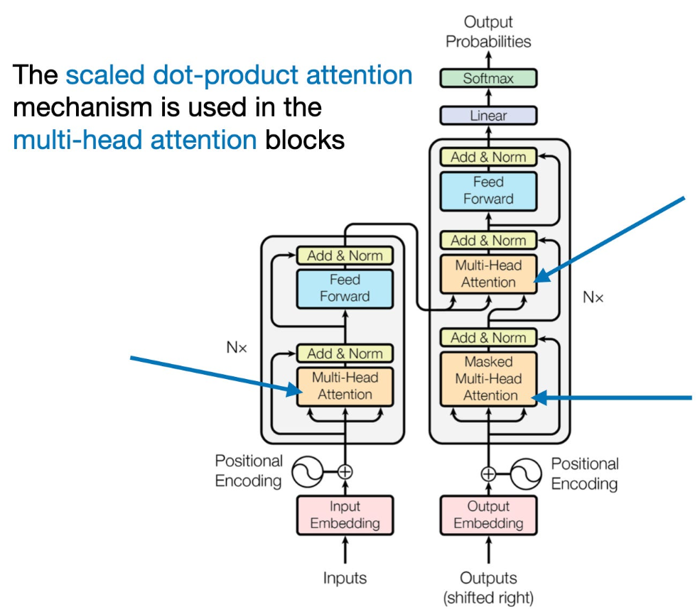
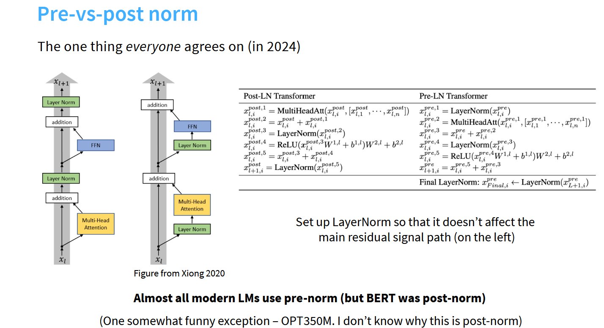
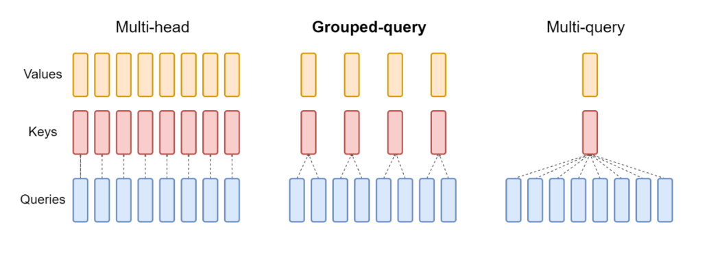
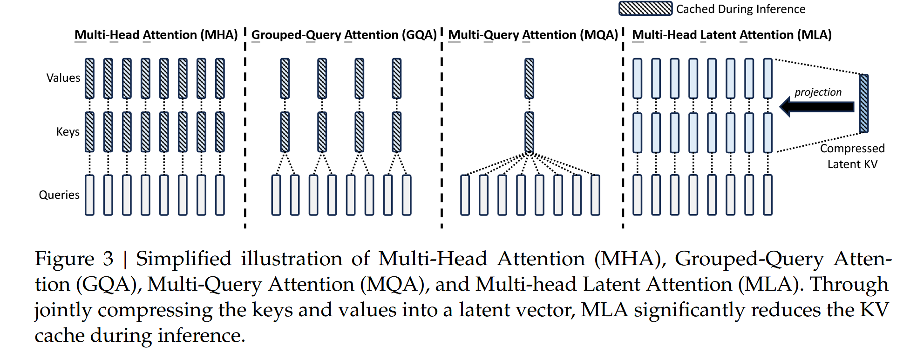
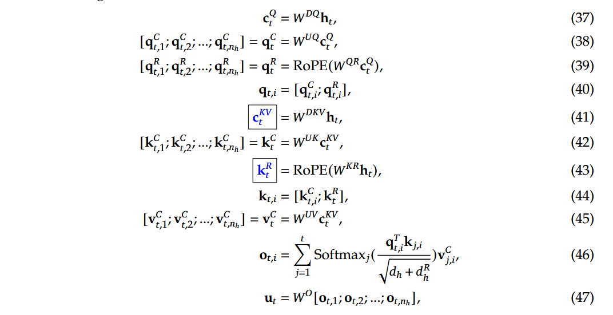

# Transformer code from scratch
实现原始Transformer的构建

## 架构
original:

    

## 主流Transformer改进介绍

目前主流Transformer模型架构
- 模型里基本`无bias`，但Qwen中使用bias
- Position embeddings基本采用`RoPE`
- Attention采用`GQA`
- FFN采用`SwiGLU FFN`
- 使用`Pre-norm`

### Position embeddings
目前主流采用RoPE（旋转位置编码）。RoPE的核心思想是通过旋转矩阵将位置信息融入到模型的表示中

旋转矩阵的构造基于复数和平面旋转的概念。通过将位置信息映射到复数平面上，可以得到一系列的旋转角度，从而构造出旋转矩阵

RoPE存在问题：
- 外推性不好，无法较好训练长文本，而模型无法泛化超过它们训练的序列长度

改进：`YARN (Yet Another Rescaling Method)`

### FFN
使用`SwiGLU FFN`

`Swish`：$Swish_ß(x) = x*sigmoid(ß x)$
- $ß$ 是一个可学习的参数。 Swish 比 ReLU 激活函数更好，因为它提供了 0 附近更平滑的过渡，可以带来更好的优化

`GLU`：$GLU(x) = sigmoid(Wx+b)⊗(Vx+c)$
- $sigmoid(Wx+b)$作为门控，控制$(Vx+c)$的输出
- 人们发现 GLU 可以有效捕获序列中的长程依赖性，同时避免与 LSTM 和 GRU 等其他门控机制相关的一些梯度消失问题

`SwiGLU`:$SwiGLU(x) = Swish_1(Wx)⊗(Vx)$=$sigmoid(Wx)*(Wx)⊗(Vx)$
- 是`Swish`和`GLU`的组合。它是一个 GLU，但没有使用 sigmoid 作为激活函数，而是使用 swish 但 $ß$=1

`SwiGLU FFN`：$FFNSwiGLU(x) = (Swish_1(xW_1)⊗xV)W_2$

### RMSNorm

    

使用`Pre-norm`，原始Transformer使用`Post-norm`

RMSNorm:不减去均值或添加残差
- 更少的操作（无均值计算)
- 更少的参数（无需存储偏差项）
- RMSNorm 可以更快，因为它的内存访问次数更少

### Attention

    

DeepSeek-V2提出`MLA`,极大降低推理成本

    

论文中的公式：

    

- 使用down-projection 和 up-projection 矩阵来存储QKV
- 原始的RoPE需要在query和key中融入相对位置信息。在MLA中，在query中融入相对位置信息是比较容易的，但是由于KV Cache缓存的是压缩后的低秩key-value信息，这里面是没办法融入相对位置信息的。
提出了解耦 RoPE 策略。

MLA通过恒等变换实现低秩KV Cache，虽然这会增大每个头的Q/K尺寸，导致计算量上升，但最终效率提升。之所以能提升效率是因为LLM推理主要瓶颈还是访存而不是计算这一特性。

### 参考：
[Stanford CS336 | Language Modeling from Scratch](https://stanford-cs336.github.io/spring2024/)

[GitHub - rasbt/LLMs-from-scratch: Implement a ChatGPT-like LLM in PyTorch from scratch, step by step](https://github.com/rasbt/LLMs-from-scratch)

[尽量“手撕”代码系列 - 飞书云文档](https://dwexzknzsh8.feishu.cn/docx/VkYud3H0zoDTrrxNX5lce0S4nDh)

[缓存与效果的极限拉扯：从MHA、MQA、GQA到MLA - 科学空间|Scientific Spaces](https://spaces.ac.cn/archives/10091)
